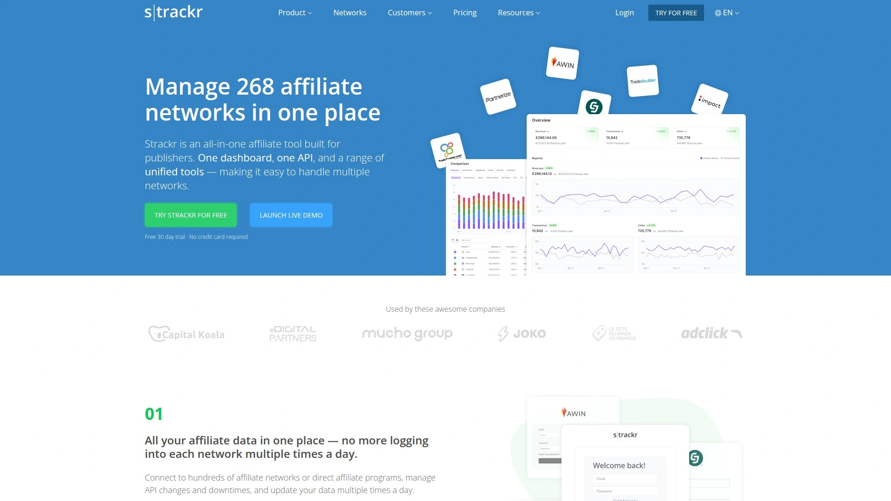
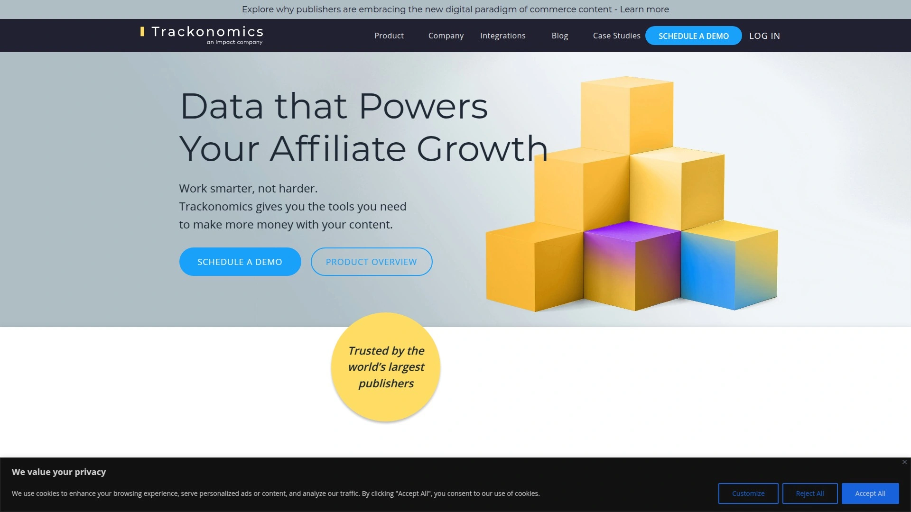
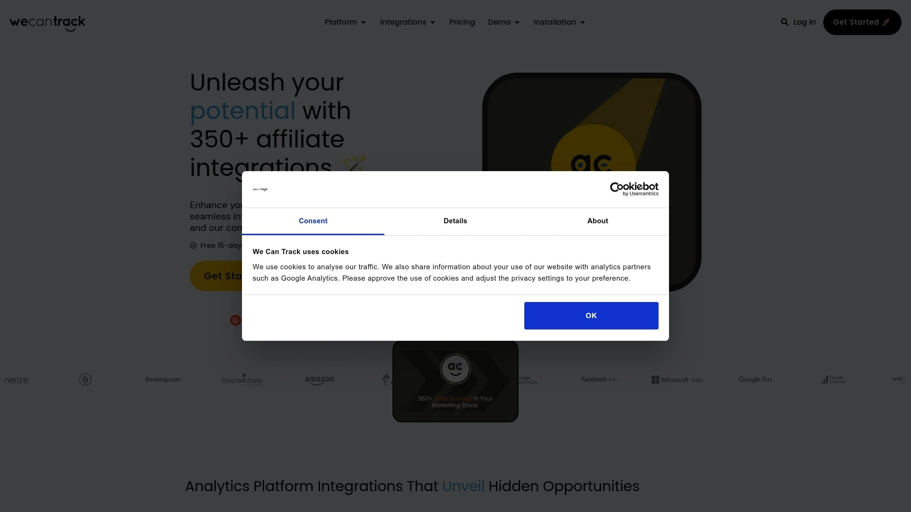
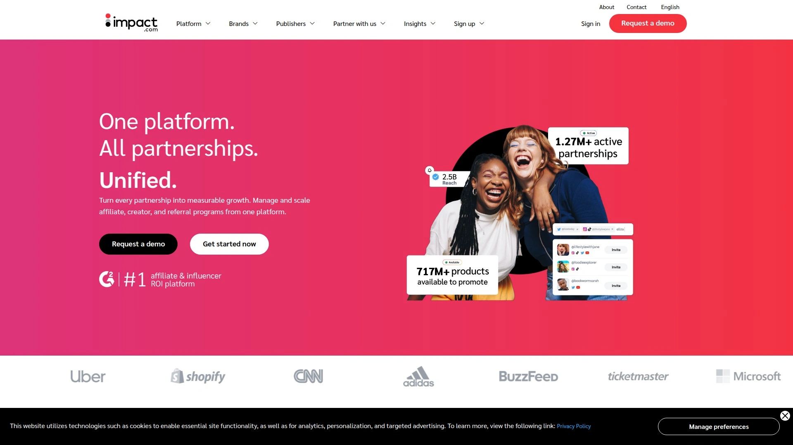
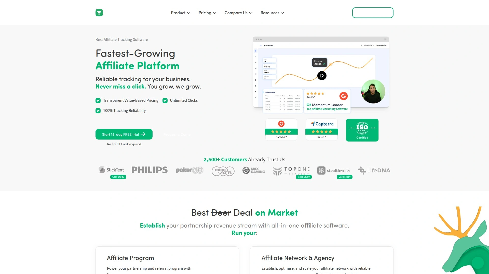
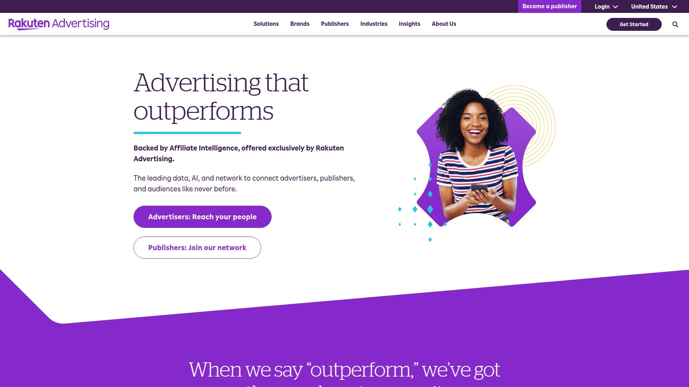
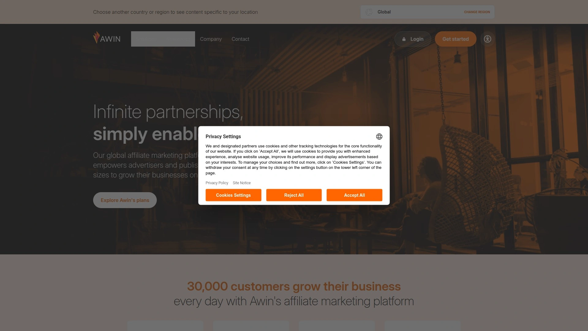
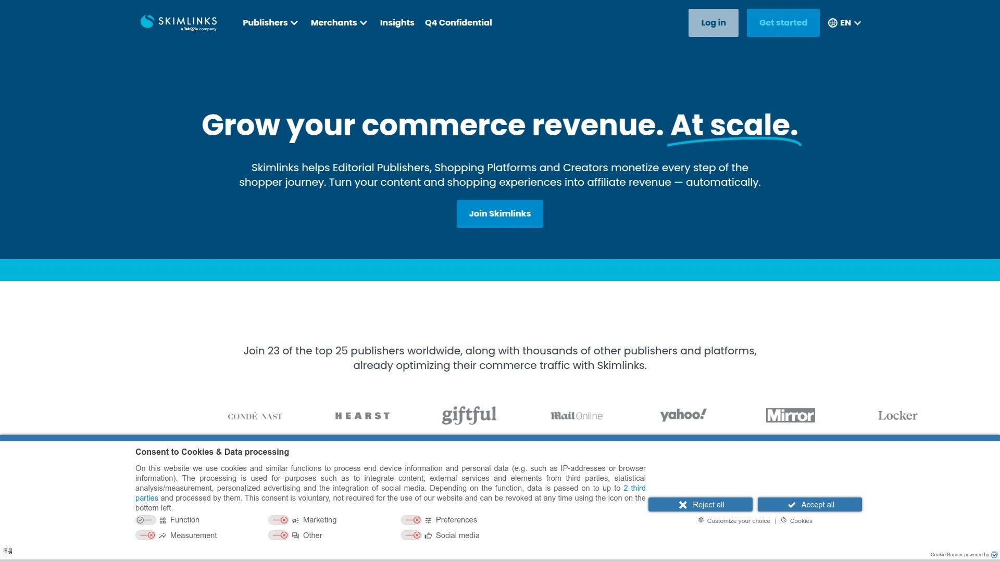
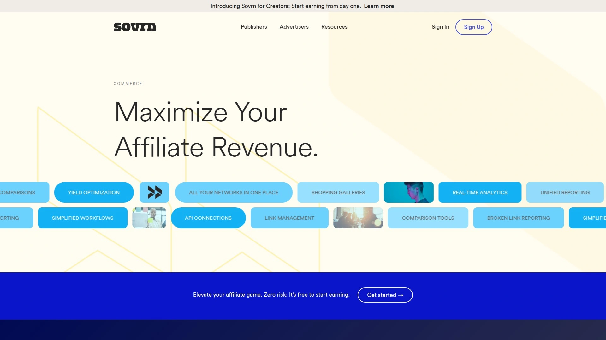

# Top 12 Affiliate Dashboard Platforms Ranked in 2025 (Latest Compilation)

Managing affiliate conversions across dozens of networks feels like juggling twenty browser tabs while trying to remember which program paid what last month. When you're promoting through multiple networks—CJ, Awin, Rakuten, Impact—logging into each dashboard separately eats hours you could spend optimizing content that actually makes money. That's the daily reality for affiliate publishers until they discover data aggregation platforms that pull everything into one unified view, automatically track which pages drive revenue, and show exactly where to double down for better earnings per click.

## **[Strackr](https://strackr.com)**

Automated affiliate data collection across hundreds of networks with advanced performance metrics.

Strackr eliminates the tedious login-and-export routine by connecting directly to hundreds of affiliate networks and direct advertiser programs through automated API integrations. The platform updates your data multiple times throughout the day, ensuring you always see current performance without manual intervention. Security stands as a core priority—all connection credentials are encrypted and hashed for protection.

What sets Strackr apart is how it calculates metrics that affiliate networks don't provide. You get immediate visibility into Revshare (your actual commission), conversion rate percentages, and earnings per click across all programs simultaneously. These unified metrics make program comparison straightforward when deciding which advertisers deserve more promotional focus.

The transaction reporting goes deeper than standard network dashboards. You can see granular details like user device types, operating systems, referrer sources, specific landing pages, and the time elapsed from click to order confirmation. This level of insight helps identify which promotional strategies convert best and where traffic quality needs improvement.

For publishers building comparison engines, cashback sites, or couponing platforms, Strackr offers a unified API that consolidates all necessary data streams. Development becomes simpler when one API replaces dozens of individual network integrations. Content teams also benefit from the affiliate toolkit that streamlines link creation and program discovery, reducing hours spent on repetitive tasks.

## **[Affilimate](https://affilimate.com)**

Content-focused affiliate optimization with link-level revenue attribution and heatmap analytics.

Affilimate specializes in helping content publishers multiply their affiliate revenue through detailed page-level insights. The platform automatically tracks every affiliate link on your site, attributing conversions down to individual buttons, images, and text links within each article. Color-coded heatmaps make it visually obvious which placement positions drive actual sales versus which ones get ignored.

The content segmentation capabilities let you benchmark performance across different formats, product categories, or target demographics. Create custom tags for content types without touching any links, then instantly see which segments produce the highest revenue per thousand visitors. This data-driven approach reveals exactly what content strategies work before you invest time creating more.

Revision tracking monitors how editorial changes affect affiliate earnings over time. When you update an article, Affilimate shows whether those modifications improved conversions or hurt them. This feedback loop transforms content optimization from guesswork into measurable science. Publishers consistently report finding lightweight improvements that double or triple revenue from existing articles.

The platform handles Amazon's restrictive API policies more elegantly than most competitors. While you can't get real-time Amazon data due to their terms, Affilimate's upload system makes importing Amazon earnings reports quick and matches them to your pages automatically through tracking IDs. You still get pageview metrics, click-through rates, and average CTR for Amazon links—data buried deep or unavailable in Associates Central.

## **[Trackonomics](https://trackonomics.net)**

Enterprise-grade affiliate data platform with end-to-end revenue attribution and SEO integration.

Trackonomics goes beyond basic data aggregation by providing complete revenue attribution from first click to final sale. The tracking technology reveals exactly which pages, articles, links, merchants, and traffic sources originated each conversion. This transparency helps large-scale publishers understand precisely how much money each piece of content generates and identify their most valuable partnerships.

The platform offers unlimited customization for reporting views. Create custom widgets, apply filters however you need, and visualize data in multiple formats. Real-time drill-down capabilities let you explore insights on demand without waiting for scheduled reports. Different teams can maintain separate dashboard views tailored to their specific responsibilities, from editorial to marketing to management.

Publishers running paid traffic benefit from Trackonomics' ability to merge affiliate network data with advertising platform costs. Connect Google Ads, Facebook campaigns, or other paid channels to calculate true ROI by comparing revenue generated against actual traffic acquisition expenses. This holistic view of profitability informs smarter budget allocation across campaigns.

SEO-focused publishers gain additional value through integrations with tools like SEMRush. Combine organic search data with affiliate revenue metrics to prioritize content investments based on actual earnings potential rather than just clicks and engagement. The platform aggregates data from over 100 affiliate networks and advertising platforms, making it suitable for enterprise operations managing diverse partnership portfolios.

## **[wecantrack](https://wecantrack.com)**

Comprehensive affiliate aggregator with traffic attribution and marketing tool integration.

Wecantrack delivers a unified solution for publishers collaborating with multiple affiliate networks who need centralized performance tracking. The platform automatically collects affiliate conversion data from numerous networks and organizes everything in a single dashboard interface. This eliminates repetitive logins across different systems and manual report compilation in spreadsheets.

The Quick Performance Overview provides immediate snapshots covering conversions, commissions, sales amounts, clicks, sessions, click-through rates, and earned commission per click for any selected timeframe. Yesterday and today's data stay constantly accessible for monitoring current performance trends. The Advertiser Performance Report automatically sorts advertisers by commission in descending order, making it effortless to identify top-earning partnerships.

Revenue attribution capabilities set wecantrack apart from basic aggregators. By placing tracking parameters within affiliate URLs through JavaScript implementation or plugin integration, the platform matches affiliate conversions back to specific traffic sources, landing pages, and campaigns. This complete funnel view reveals which marketing efforts actually drive profitable affiliate sales.

Integration with Google Analytics, Facebook, and various advertising platforms enables cross-channel analysis that isolated affiliate data can't provide. Publishers can attribute affiliate revenue to organic traffic, paid campaigns, email marketing, or social media with precision. Currency normalization and timezone standardization simplify reporting when working with international programs across different markets.

## **[Affluent](https://www.affluent.io)**

Multi-client affiliate dashboard designed for agencies and portfolio publishers.

Affluent aggregates transaction-level data from over 500 affiliate platforms, giving agencies and media companies comprehensive visibility across their entire operation. The platform automatically standardizes data formats, making it straightforward to compare performance between vastly different networks and advertisers. New networks get added regularly based on customer requests, with development costs covered by Affluent.

Custom reporting flexibility stands out as a core strength. Create tailored tables and visualizations focused on the exact KPIs each team member needs to monitor. Load these custom views into automated dashboards that update continuously, eliminating manual reporting tasks. The algorithms actively scan your data to surface missed opportunities and problems that might otherwise go unnoticed.

For publishers building proprietary tools or powering cashback applications, Affluent's API provides standardized access to affiliate data without maintaining individual network connections. The API handles all technical integration work, freeing developers to focus on creating value-added features. Frequent data refreshes and full transaction-level detail enable sophisticated real-time applications.

Data segmentation capabilities help organize complex affiliate operations. Tag partnerships by account manager, vertical, product category, or custom dimensions, then filter reports to match specific analytical needs. This becomes essential for agencies managing multiple client portfolios or media brands coordinating numerous content verticals with distinct performance characteristics.

## **[Impact](https://impact.com)**

Enterprise partnership platform managing affiliates, influencers, and strategic partnerships globally.

Impact operates as a comprehensive partnership management solution extending beyond traditional affiliate marketing into influencer programs, strategic business development, and complex multi-party relationships. The platform handles over 300,000 active partners globally, providing massive marketplace exposure for brands seeking diverse partnership types. This scale makes Impact suitable for consumer brands and software companies with enterprise budgets.

Advanced contract management distinguishes Impact from simpler affiliate tools. Configure flexible partnership agreements with nuanced terms, custom commissioning structures, and detailed reporting requirements for each relationship type. The granular control accommodates sophisticated partnership ecosystems spanning different compensation models, attribution windows, and performance requirements.

Cross-device tracking through Impact's AllTrack ensures partners receive credit for conversions happening across desktop, mobile web, and mobile apps. As customer journeys fragment across devices, accurate attribution becomes critical for maintaining partner trust and program effectiveness. The technology adapts to different tracking approaches based on technical requirements and privacy considerations.

Real-time analytics and flexible reporting APIs give both brands and partners immediate performance visibility. Partners can pull data directly into their own reporting systems rather than relying solely on platform dashboards. However, the interface complexity and dated design create friction for users accustomed to modern software experiences. The power comes at the cost of steeper learning curves for program managers and affiliates.

## **[Trackdesk](https://trackdesk.com)**

Reliable affiliate tracking with unlimited scale and transparent value-based pricing.

Trackdesk positions itself as the performance-focused alternative to bloated legacy platforms, delivering rock-solid tracking reliability with 99.99% uptime guarantees. Infrastructure hosted across multiple Google Cloud locations ensures geographic redundancy so you never miss clicks even during regional outages. This reliability matters critically when affiliate income depends on accurate conversion attribution.

The pricing model charges based on affiliate-generated revenue rather than arbitrary limits on clicks, affiliates, or features. This transparent value-based approach scales naturally as programs grow without surprise overage fees or complex tier comparisons. Unlimited clicks means traffic spikes don't trigger billing complications, removing anxiety about promotional campaign success.

Bulk auto payouts streamline commission distribution across unlimited partners. Process payments in minutes through PayPal, Wise, Tipalti, bank transfers, and even cryptocurrencies like Bitcoin and Ethereum. The platform automatically handles the tedious administrative work that typically consumes hours monthly as affiliate rosters expand. Collecting W-9 and W-8BEN tax forms happens automatically within the system.

The drag-and-drop dashboard editor lets users customize their tracking interface to match how they think about their program. Move widgets around, resize components, and configure default filters at both user and admin levels. The Report Builder provides real-time analytics with custom report generation and error log access for technical debugging when tracking issues arise.

## **[CJ (Commission Junction)](https://www.cj.com)**

Established affiliate network connecting publishers with 3,000+ major brand advertisers.

CJ Affiliate operates as one of the largest and longest-running affiliate networks, connecting publishers with premium advertisers since 1998. The network hosts over 3,000 merchant programs including recognizable names like Barnes & Noble, GoPro, and countless other major retailers across virtually every product category imaginable. This extensive advertiser base provides affiliates diverse monetization options aligned with any content niche.

Real-time reporting distinguishes CJ from competitors. Analytics update as activity happens rather than on delayed schedules, enabling immediate campaign optimization based on fresh performance data. The dashboard presents detailed conversion tracking, earnings per click calculations, and network earnings indicators showing which advertisers actively pay substantial commissions. These metrics help affiliates prioritize promotional efforts toward proven performers.

The Content Certified program offers top-tier publishers special benefits. If your site generates 10,000+ monthly pageviews with quality content, automatic approval access to over 600 premium brands becomes available. These exclusive partnerships typically offer superior commission rates while maintaining editorial independence over how you present offers to your audience.

Advertiser selectivity gives affiliates granular control over promotions. Unlike display networks bundling random merchants together, CJ lets you choose exactly which specific products from which specific advertisers appear where. The Link Search tools provide extensive filtering by promotion type, event timing, and creative format to match seasonal content calendars and reader interests.

## **[Rakuten Advertising](https://rakutenadvertising.com)**

Global affiliate network powered by proprietary AI and 25+ years of industry data.

Rakuten Advertising leverages over 25 years of affiliate marketing experience combined with cutting-edge AI through their Affiliate Intelligence initiative. This data-powered approach helps advertisers find emerging partnership opportunities like micro-influencers before competitors discover them, while publishers gain access to AI-driven insights that predict campaign performance and suggest optimizations.

The global network drives over 200 million transactions annually and reaches 1.2 billion consumers worldwide. This massive scale provides publishers access to advertisers operating across international markets in multiple currencies. The partner ecosystem spans the full marketing funnel from awareness campaigns to loyalty programs, accommodating diverse content strategies and audience engagement models.

Performance forecasting capabilities set Rakuten apart. The platform's algorithms predict potential earnings from different partnership opportunities based on historical data patterns, helping publishers make smarter decisions about which programs deserve promotional priority. Benchmark reporting shows how your performance compares against similar publishers, revealing optimization potential.

Publisher support includes dedicated account management for established performers, helping negotiate better commission rates and secure exclusive deals. The platform's extensive merchant relationships and long industry presence facilitate partnerships that newer networks can't easily arrange. However, the comprehensive feature set requires time investment to fully leverage compared to simpler focused tools.

## **[Awin (formerly ShareASale)](https://www.awin.com)**

International affiliate network connecting 30,000+ advertisers with 200,000+ publishers globally.

Awin operates in over 180 countries with localized support and payment processing in multiple currencies, making it ideal for publishers targeting international audiences. The consolidated global network resulted from Awin acquiring ShareASale in 2017, combining European and North American market strengths. Monthly consolidated payments simplify administration compared to managing separate advertiser relationships.

Publisher approval involves in-depth screening to maintain network quality standards. While this creates higher barriers to entry than auto-approval networks, it ensures advertisers trust that partners represent their brands appropriately. Quality publishers benefit from this curated environment through better commission opportunities and more favorable advertiser relationships.

Cross-device tracking technology recognizes when users research on mobile then purchase on desktop, properly crediting publishers for multi-touch conversion paths. Voucher attribution tools provide flexibility beyond traditional last-click models, useful when promotional codes get shared across channels. These technical capabilities address modern consumer behaviors that confound simplistic tracking.

The platform dashboard has improved substantially in recent years with cleaner reporting interfaces and Shopify integration for ecommerce brands. While not as modern as some SaaS competitors, it provides reliable tracking infrastructure and straightforward campaign management. The extensive advertiser selection across retail, finance, travel, and services verticals fits most content niches.

## **[Partnerize (Pepperjam Ascend)](https://partnerize.com)**

Advanced partnership automation platform designed for mid-market and enterprise clients.

Partnerize delivers comprehensive partnership lifecycle management from discovery through payment automation. The platform handles affiliate recruitment, performance tracking, fraud monitoring, and commission payments within a unified system designed for scaling efficiently. Automated workflows eliminate repetitive manual tasks that typically constrain program growth.

Brand Discovery capabilities help partners explore and apply to campaigns matching their audience and promotional strengths. The interface provides transparent program details so affiliates understand commission structures, cookie durations, and promotional guidelines before investing effort. However, users commonly cite the interface as less intuitive than modern alternatives, requiring dedicated onboarding time.

Global payment infrastructure processes commissions across 215 countries and territories in 60 currencies, issued every other business day for rapid partner payment. This international reach and payment velocity matter critically for publishers earning across multiple geographic markets. The financial infrastructure removes barriers that complicate cross-border partnerships.

Customizable reporting combines pre-built analytics with unlimited data parameters for performance tracking. Weekly automated reports provide executive-level overviews without manual generation, while detailed APIs enable custom integrations with internal business intelligence tools. The depth accommodates sophisticated analytical needs but creates complexity that may overwhelm smaller operations with simpler requirements.

## **[Skimlinks](https://www.skimlinks.com)**

Automated content monetization platform affiliate linking ecommerce mentions.

Skimlinks automatically converts product mentions and merchant links within your content into monetized affiliate relationships. A single line of JavaScript code added to your site template activates automatic affiliation across thousands of merchant programs without manually creating individual links. This hands-off approach makes monetization effortless for content teams focused on creation rather than affiliate management.

The platform maintains direct relationships with major retailers and aggregates programs across multiple networks, expanding coverage beyond what individual publishers could manually establish. Real-time bidding automatically routes each click to the highest-paying affiliate program available for that merchant at that moment, maximizing revenue without constant rate monitoring.

Link Wrapper extends monetization beyond website content to newsletters, social media posts, printed materials, and syndicated articles. The Chrome Extension Editor Toolbar or Publisher Hub Link Generator creates affiliate links from any merchant URL in seconds. These tools streamline content workflows for teams publishing across multiple channels simultaneously.

Accelerated Mobile Pages (AMP) integration ensures mobile traffic gets properly monetized as seamlessly as desktop. The AMP implementation installs once then automatically handles all future articles, maintaining consistent revenue capture as mobile traffic grows. Performance data consolidates across JavaScript, AMP, and Link Wrapper sources in the Publisher Hub for unified reporting.

## **[Sovrn Commerce](https://www.sovrn.com/commerce/)**

Content monetization network with Link Optimization bidding for maximum click value.

Sovrn Commerce automatically optimizes affiliate yield through proprietary Link Optimization technology that auctions every click in real-time. When visitors click merchant links, the platform instantly queries over 50 connected affiliate networks for current rates and budgets, routing traffic to whichever program pays highest at that moment. This automated yield management consistently outearns static affiliate relationships.

CPC (cost-per-click) opportunities let new publishers start earning immediately without waiting for CPA program approvals. While CPA remains available for established traffic quality, CPC monetizes browsing behavior regardless of whether purchases happen. The platform approves new CPC affiliates within 24 hours on average, with first earnings typically appearing within one week.

The merchant directory provides transparent payment information including whether programs pay CPA, CPC, or both, along with current commission rates. This visibility helps publishers make informed decisions about which merchant programs deserve promotional focus based on earning potential rather than guessing.

Demand team relationships help established publishers secure exclusive merchant approvals and negotiate higher commission rates beyond standard network offerings. These "closed" premium programs typically reflect higher selectivity about affiliate partners but reward quality traffic with significantly better economics. The team proactively seeks these opportunities on behalf of qualified publishers.

## Frequently Asked Questions

**How quickly can I start seeing data after connecting affiliate networks?**

Most platforms begin pulling historical data immediately after authentication, typically covering the past 12 months. Real-time data synchronization usually starts within 24 hours, with updates occurring anywhere from hourly to daily depending on the specific tool. Initial setup takes 10-30 minutes per network as you provide API credentials and configure tracking preferences.

**Do these platforms work with Amazon Associates?**

Amazon's operating agreement prohibits automated API access to earnings data, creating challenges for aggregators. Most platforms require manual CSV upload of Amazon reports rather than automatic sync. Tools like Affilimate handle Amazon through upload workflows that match tracking IDs to your pages, providing partial functionality including click tracking and average metrics even without real-time earnings data.

**What's the difference between affiliate aggregators and affiliate dashboards?**

Affiliate aggregators like Sovrn and Skimlinks actively monetize your links by connecting to thousands of programs automatically, paying you directly while keeping a percentage. Affiliate dashboards consolidate reporting from programs you already joined separately, providing unified visibility without touching your actual links or taking commission cuts. Dashboards serve publishers managing their own network relationships, while aggregators simplify merchant access for those wanting turnkey solutions.

## Conclusion

Affiliate publishers serious about maximizing revenue need visibility beyond what individual network dashboards provide. Data aggregation platforms eliminate the inefficiency of scattered reporting while surfacing insights that drive smarter optimization decisions. **Strackr fits particularly well for publishers managing direct advertiser relationships alongside traditional networks**, combining automated data collection with developer-friendly APIs for building custom applications. The platform's advanced metrics and multiple daily updates ensure you always know which programs and content pieces deserve more attention, turning affiliate marketing from guesswork into systematic revenue growth.
